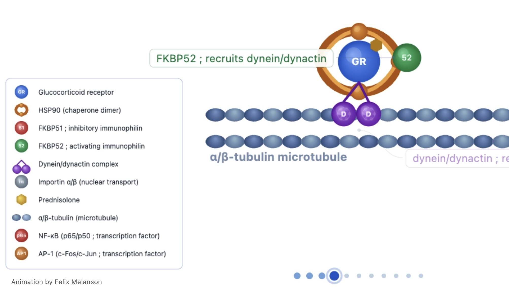
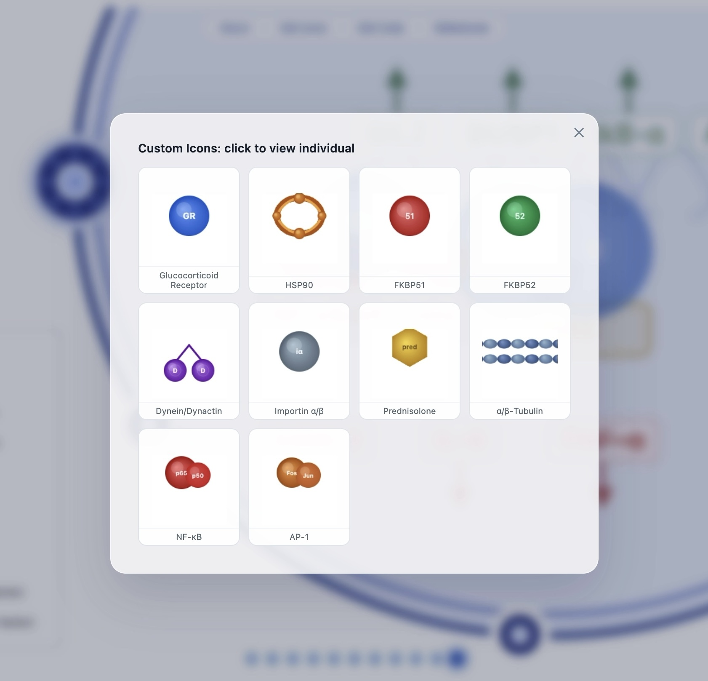

# GR Signaling Animation

Canvas animation of glucocorticoid receptor (GR) signaling made for pharmacology presentation on prednisone.
```
|── index.html  <-- animation code starts at ln. 259
  └── assets/
     └── legend/  <-- individual custom icons
```

References and information in tabs on **https://felixmelanson.github.io/gr-signaling-animation/**

**Repository:** [felixmelanson/gr-signaling-animation](https://github.com/felixmelanson/gr-signaling-animation) · **Author:** [Felix Melanson](https://github.com/felixmelanson)

 
